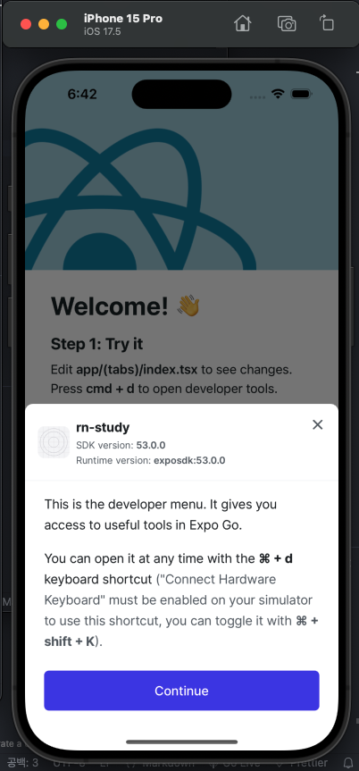

# React Native Expo Study

0. 기본 내용

- React Native는 네이티브 앱이자 크로스플랫폼 프레임워크
- React의 문법으로 Android, iOS 앱을 개발할 수 있는 크로스플랫폼 프레임워크
- 아래에서 학습하는 RN 컴포넌트(View, Text, Button 등)는 웹 브라우저의 DOM이 아니라 iOS/Android의 네이티브 UI 컴포넌트로 변환되어 렌더링된다.
  (예: <View> → iOS의 UIView, Android의 ViewGroup)
- 앱 안에서 웹페이지를 띄우고 싶다면 react-native-webview 패키지를 사용한다.
- `npx expo install react-native-webview`
- 그러면 RN 화면 일부를 웹뷰 컨테이너로 열어 웹 페이지를 로딩하는 방식이 된다.
- WebView는 해당 컴포넌트 영역 안에서만 웹브라우저 엔진을 사용한다.
- (참고로, 하이브리드 앱(Cordova, Capacitor)은 앱 전체가 WebView 위에서 돌아가고, RN 앱 + WebView는 앱 전체가 네이티브 UI로 구성되며, 일부 화면만 WebView)

1. 공식 문서 참조하여 프로젝트 생성하기
   - https://docs.expo.dev/get-started/create-a-project/
   - `npx create-expo-app@latest`
   - 특정 패키지 설치 시 `npx expo install 패키지명`
2. iOS 시뮬레이터 환경설정
   - 참조: https://docs.expo.dev/get-started/set-up-your-environment/?platform=ios&device=simulated
   - Xcode 설치 후 실행
   - `command + ,` 설정 들어가서 ios 설치
   - Locations 탭 - Command Line Tools 최신 버전 적용
   - watchman 설치
   - `npx expo start`로 프로젝트 실행, i 눌러서 시뮬레이터 실행
   - (만약 switch to expo mode가 보이는 상태라면 s를 먼저 눌러서 expo 모드로 만들고 i 누르기)
   - 시뮬레이터 실행된 상태에서 터미널에서 y 입력해서 Expo Go 앱이 설치되고, 시뮬레이터에 자동으로 실행됨
     
3. Mac에서 Android 에뮬레이터 환경설정
   - 참조: https://docs.expo.dev/get-started/set-up-your-environment/?platform=android&device=simulated
   - 우선 스킵
4. 실제 Android, iOS 기기에서 실행하기
   - 앱스토어에서 Expo Go 설치
   - `npx expo start` 했을 때 나오는 QR코드 기기에서 읽으면, 이제 실제 기기에서 프로젝트를 실행해볼 수 있다.
5. RN 기초 - 컴포넌트
   - RN 공식문서 참조 https://reactnative.dev/docs/components-and-apis
   - View는 웹에서 div와 유사한 역할을 하지만, 하위에 바로 텍스트를 적용할 순 없다. Text 컴포넌트를 사용해야 한다.
   - TextInput을 사용 시, focus 됐을 때 iOS의 경우 키보드를 띄우려면 `command + k`
   - Button 사용 시, title로 버튼명을 적용할 수 있다.
   - RN에서는 onClick이 아니라 onPress로 클릭 핸들러를 연결할 수 있다.
   - Pressable: 버튼이 아니라, 클릭해야 하는 영역을 사용할 때, 더 디테일한 동작을 제어할 수 있다. 마찬가지로 하위에 바로 텍스트를 적용할 수 없다.
   - 웹과 달리 RN에서는 display: flex를 사용하지 않아도 된다.
   - RN에서는 기본적으로 flex direction이 가로가 아니라 세로로 표시됨. 세로로 표시하려면 flexDirection: row를 추가
6. Navigation 구조 설정(Expo Router)
   - Next.js 페이지 라우터 방식처럼 각 폴더가 경로가 되고, 파일명도 경로가 된다.
   - 폴더명이 괄호라면 경로를 무시함(Next.js 앱 라우터 방식과 동일)
   - 각 폴더 하위엔 `_layout.tsx` 레이아웃 파일이 있을 수 있다.
   - 레이아웃 파일에서는 expo-router에서 제공하는 [Tabs](https://docs.expo.dev/router/advanced/tabs/), [Stack](https://docs.expo.dev/router/advanced/stack/) 등을 사용할 수 있다.
   - Tabs: 화면 하단에 탭 바가 있고, 탭 버튼을 눌러서 페이지 전환
   - Stack: 화면이 쌓이고(pop/push) 이동하는 구조(다음 화면으로 전환할 때 자연스러운 애니메이션 제공함)
   - Tab이 아닌 화면에서는 기본적으로 Stack을 사용함
   - `screenOptions={{ headerShown: false }}`는 네비게이터(Stack, Tabs, Drawer 등)에서 기본으로 제공되는 상단 헤더(타이틀 바)를 숨기는 옵션
7. 아이콘 적용하기(expo-vector-icons)
   - https://icons.expo.fyi/Index
