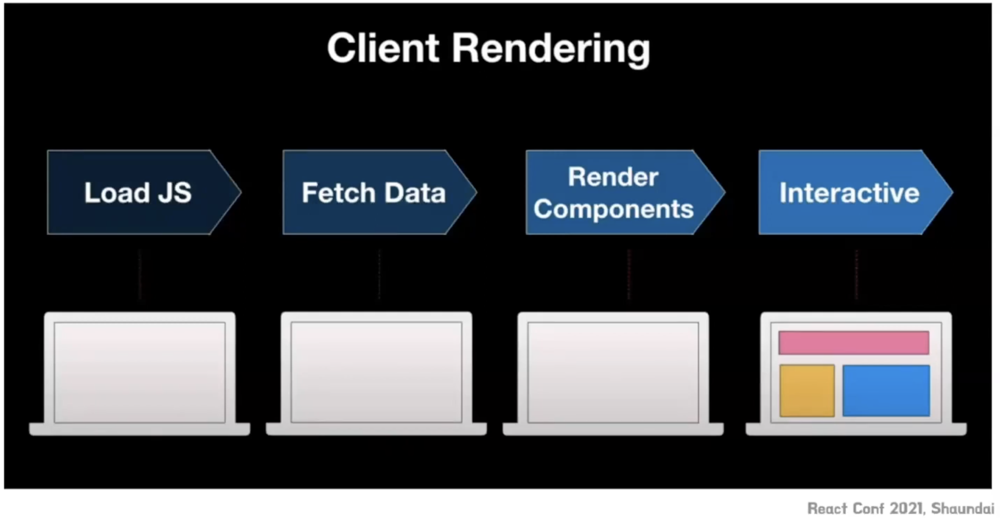

## 18버전

참조:

- https://velog.io/@woodong/React-18-%EC%A3%BC%EC%9A%94-%EB%B3%80%EA%B2%BD%EC%A0%90#2-concurrent-feature
- https://youtu.be/focpJqfSu4k?si=9q2LKdsIbPrnc_Em

### 1. [useTransition](https://ko.react.dev/reference/react/useTransition) & useDeferredValue

- UI의 일부를 백그라운드에서 렌더링 할 수 있도록 해주는 React Hook

어떤 문제점을 해소하기 위해 추가된 기능인가?

- Blocking rendering(블로킹 렌더링 문제)

  - 한번 렌더링 연산이 시작되면 멈출 수 없음
  - 대형 화면 업데이트의 경우 렌더링 되는 동안 페이지 지연이 발생함

  ```jsx
  function App() {
    const [boxCount, setBoxCount] = useState(0);

    const newItems = makeItems(boxCount);

    const handleUpdate = ({ target }) => {
      setBoxCount(target.value.length);
    };

    return (
      <div>
        <input type="text" onChange={handleUpdate} />
        <ItemList items={newItems} />
      </div>
    );
  }

  export default App;
  ```

  - 위 코드는, input에서 입력이 발생할 때마다 boxCount가 늘어나고 있고, 그때마다 ItemList 에서 박스 ui를 카운트개수 만큼 추가하고 있다.
  - 문제점: 만약 입력이 아주 많아질 경우, 박스가 엄청 많이 추가되는데, 이때 **input** 반영이 늦어지는 문제점.

이것을 useTransition으로 개선한 코드:

(기존에 사용자 경험을 개선하기 위해 사용했던 디바운스 / 쓰로틀링 / setTimeout 등의 기능을 지원함)

- `const [isPending, startTransition] = useTransition();`

```jsx
function App() {
  const [isPending, startTransition] = useTransition();
  const [boxCount, setBoxCount] = useState(0);

  const newItems = makeItems(boxCount);

  const handleUpdate = ({ target }) => {
    startTransition(() => {
      setBoxCount(target.value.length);
    });
  };

  return (
    <div>
      <input type="text" onChange={handleUpdate} />
      {isPending && <h1>Pending...</h1>}
      <ItemList items={newItems} />
    </div>
  );
}

export default App;
```

- startTransition에 action(함수)를 넘기면, action 내부의 상태 업데이트는 우선순위가 **낮은** 작업으로 처리된다.
- 키 입력이나 클릭과 같은 우선순위가 높은(urgent) 업데이트가 발생하면, startTransition 내부의 업데이트는 일시 중단되며, 우선순위가 높은 작업이 끝난 후 다시 실행된다.
- 이를 통해 UI가 사용자 입력에 즉각적으로 반응하도록 하면서, 비동기적/비핵심적인 작업을 뒤로 미룰 수 있다.
- isPending: 대기 중인 Transition 이 있는지 알려주는 플래그
- 위 코드를 실행하면, isPending 텍스트가 화면에 보이고, input에 입력한 값이 화면에 바로바로 반영이 된다.
- debounce, throttle을 사용하면 화면 업데이트를 단순히 지연하거나, 의미없이 기다릴 수 있다는 단점을 해결함.

startTransition 내부 원리:


급한 작업에 우선순위를 줄 수 있게 되어 사용자 경험을 향상할 수 있게 됨.

더 자세히는 동시성의 개념


React 18 버전부터는 Concurrent Mode( 동시성 )를 하나의 기능으로 지원한다고 함.

> - **동시성**이라는 개념을 활용하여 여러 작업을 동시에 처리하도록 React는 구현하고 있습니다.
>   - 여러 작업을 작은 단위로 나눈 후 작업들 간의 우선순위를 정합니다.
>   - 정해진 우선순위에 따라 작업을 수행하는 방법입니다.
>   - 즉 실제로는 동시에 작업이 수행되지는 않지만 작업 간의 전환이 매우 빠르기 때문에 동시에 수행되는 것처럼 보입니다.
> - 왜 React는 **Concurrent Mode**를 개발하려고 하는가?
>   - **사용자 경험**에서 아주 중요한 역할을 가집니다.
>   - 디바운스와 쓰로틀링
>     - 기본적으로 Input 관련 기능을 이용할 때 **디바운스 / 쓰로틀링**을 활용합니다.
>       - 이 문서에서는 디바운스 / 쓰로틀링이 무엇인지 설명하지 않습니다.
>       - 궁금하시면 꼭 찾아보시길 권장합니다.
>     - 사용자 경험을 개선하기 위해 자주 활용되지만 한계점이 존재
>       - 디바운스: 무조건 일정 시간을 기다려야 함
>       - 쓰로틀링: 성능이 좋은 기기에서는 사용자 경험을 높일 수 있지만 성능이 안좋은 기기에서는 버벅거리는 현상이 발생
>     - **Concurrent Mode**는 이와 같은 한계점을 해결할 수 있습니다.
>       - 작업간의 우선순위를 정하여 사용자 입력 / 다른 작업들을 동시에 처리되는 경험을 보여줄 수 있고 개발자가 설정한 **Delay**에 의존되는 것이 아닌 사용자 기기 성능에 따라 달라지게 됩니다.
>   - [suspense](https://ko.reactjs.org/docs/concurrent-mode-suspense.html) 기능
>     - React는 **suspense**기능을 지원하여 해당 페이지를 불러오기 전 로딩 기능을 지원하고 있습니다.
>     - 하지만 기기 성능이 좋다보니 빠른 렌더링을 지원함에도 불구하고 의미없는 로딩을 보여주게 됩니다.
>     - **Concurrent Mode**는 일정 시간동안 현재 페이지를 유지하면서 다음 페이지의 렌더링에 대한 작업을 동시에 진행하게 됩니다.

#### (+) [useDeferredValue](https://ko.react.dev/reference/react/useDeferredValue)

useDeferredValue는 useTransition과 동일하지만, 함수가 아닌 상태값의 우선순위를 낮추는 hook이다.

```js
const deferredValue = useDeferredValue(value);
```

### 2. Suspense & SSR

CSR, SSR에 대한 이해


<br />

1. JS 파일 로드 후 실행이 시작됨
2. 브라우저에서 API 요청 → 데이터 가져옴\*(Data Fetching)
3. 받아온 데이터를 기반으로 컴포넌트를 렌더링
4. 사용자에게 화면 표시
   <br />
   <br />


<br />

1. 서버에서 먼저 API 요청 → 데이터 가져옴 (Data Fetching)
2. 서버에서 데이터와 함께 HTML을 생성
3. 브라우저에 완성된 HTML을 전달
4. 이후 JS를 로드하고 Hydrate(이벤트 연결)
   <br />

기존 SSR의 문제점:

- 모든 data fetch가 끝나야 어떤 것이라도 보여줄 수 있다.
- 모든 자바스크립트 코드를 로딩하기 전에는 Hydration 단계로 넘어갈 수 없다.
- 앱이 상호 작용할 수 있는 상태가 되려면 앱 전체가 Hydration이 완료되어야 한다.<br/>
   <br />
  위와 같이 각 단계를 거쳐야 Hydration이 완료된다.

18버전부터는 페이지의 각 부분을 Suspense를 묶어서 따로 처리할 수가 있게 된다.

<br />

위와 같이 Suspense를 사용하면 Streaming SSR이 가능해진다.
(HTML을 완성된 후 한꺼번에 보내지 않고, 부분적으로(스트리밍) 전송하는 SSR 방식)

Comments 컴포넌트를 기다리지 않고 다른 부분부터 보여주고, 데이터 페칭이 끝나고 렌더링이 완료되면 그때 Comments 컴포넌트가 화면에 보이게 된다.

<br />

그러나, Comments 컴포넌트에 대한 자바스크립트 코드를 로드하기 전에는 Hydration 할 수 없는데, 이는 lazy import를 하여 해소할 수 있게 된다.
(즉, React.lazy는 코드 스플리팅)

```jsx
import { lazy } from "react";

const Comments = lazy(() => import("./Comments.js"));

// ...

<Suspense fallback={<Spinner />}>
  <Comments />
</Suspense>;
```

lazy 가 아닌 부분은 즉시 하이드레이션 하고, Comments 부분의 하이드레이션은 지연시킴

### 3. Automatic Batching

여러 state 업데이트를 하나의 rerender가 발생하도록 그룹화

+) 배칭 처리를 원하지 않을 경우 `import { flushSync } from "react-dom";` 을 가져와서 사용하면 각각 렌더링 시킬 수 있다.

## 19버전

참조:

- https://youtu.be/gdQzGkW5kps?si=sGfWPMfYReZOs4KZ
- https://seungwoo.dev/posts/react-use-optimistic
- https://velog.io/@junhopportunity/%EC%B6%9C%EC%8B%9C-%EC%98%88%EC%A0%95%EC%9D%B8-React%EC%9D%98-use-hook-%EC%95%8C%EC%95%84%EB%B3%B4%EA%B8%B0

  2024.12 업데이트

### 1. useTransition

- 비동기 처리도 우선순위를 적용할 수 있게 추가되었다. 나머지는 기존과 동일하다.
- 그래서 isPending으로 비동기 로딩 상태까지 관리할 수 있게 되었다.

```jsx
import { useState, useTransition } from "react";
import { updateQuantity } from "./api";

function CheckoutForm() {
  const [isPending, startTransition] = useTransition();
  const [quantity, setQuantity] = useState(1);

  function onSubmit(newQuantity) {
    // 비동기 함수
    startTransition(async function () {
      const savedQuantity = await updateQuantity(newQuantity);

      // 우선순위가 낮은 상태 업데이트:
      startTransition(() => {
        setQuantity(savedQuantity);
      });
    });
  }
  // ...
}
```

### 2. useActionState

- 폼 action의 결과를 기반으로 State를 업데이트할 수 있도록 제공하는 Hook
  - form 말고도 사용자가 발생시킨 모든 이벤트에 적용 가능
- 리액트에서 정의하는 action은 비동기 함수를 의미함.
- 즉, ActionState는 비동기 처리에 관련된 모든 state를 의미함.

`const [state, formAction, isPending] = useActionState(fn, initialState, permalink?);`

- fn: 폼이 제출되거나 버튼이 눌렸을 때 호출되는 비동기 함수
- initialState: 초깃값
- permalink(영구 링크)
- 단, 응답 데이터는 따로 state로 관리해야 함

```jsx
import { useActionState, useState } from "react";
import { addToCart } from "./actions.js";

function AddToCartForm({ itemID, itemTitle }) {
  const [formState, formAction] = useActionState(addToCart, {});
  return (
    <form action={formAction}>
      <h2>{itemTitle}</h2>
      <input type="hidden" name="itemID" value={itemID} />
      <button type="submit">Add to Cart</button>
      {formState?.success && (
        <div className="toast">Added to cart! Your cart now has {formState.cartSize} items.</div>
      )}
      {formState?.success === false && (
        <div className="error">Failed to add to cart: {formState.message}</div>
      )}
    </form>
  );
}

export default function App() {
  return (
    <>
      <AddToCartForm itemID="1" itemTitle="JavaScript: The Definitive Guide" />
      <AddToCartForm itemID="2" itemTitle="JavaScript: The Good Parts" />
    </>
  );
}
```

- TanStackQuery와 비슷한 기능을 리액트에서 제공함

### 3. useOptimistic

UI를 낙관적으로 업데이트할 수 있게 해주는 React Hook

`const [optimisticState, addOptimistic] = useOptimistic(state, updateFn);`

- state: 초깃값
- updateFn: 낙관적 업데이트를 하는 함수
  - `optimisticState`(낙관적인 상태)를 계산하는 reducer 역할을 하는 함수
  - 첫 번째 매개변수로 현재 `optimisticState`의 값, 두 번째 매개변수로 `addOptimistic` 함수의 인자를 전달받음
- optimisticState: 화면에 띄울 상태값. 훅의 현재값
  - 액션이 pending 상태 경우 `updateFn` 함수가 반환한 값과 동일한 값을 가짐
  - 액션이 pending 상태가 아닐 경우 초기 `state`와 동일한 값(state가 객체일 경우 동일한 참조)을 가짐
- addOptimistic: 낙관적 업데이트할 때 호출하는 dispatch 함수(updateFn이 호출됨)
  - `optimisticState`를 변경하기 위해 호출하는 함수로, `optimisticValue` 라는 인자를 하나 받음
  - `addOptimistic` 함수를 호출하면 `updateFn`이 호출되어 `optimisticState`가 업데이트됨
  - 호출 시 전달 받은 인자가 `updateFn`의 두 번째 인자로 전달됩니다.
  - `addOptimistic` 를 호출한 다음, 비동기 요청을 하고 API 응답 결과에 따라 setState 하면 `optimisticState` 에도 알아서 롤백된 값이 초기 state가 적용됨.

```jsx
import { startTransition } from 'react'
import { Heart } from "lucide-react"
import { addLike, removeLike } from "@/app/services"

interface State {
  isLike: boolean
  count: number
}

type Value = State['isLike']

function LikeButton() {
  const [state, setState] = useState<State>({
    isLike: false,
    count: 0
  })

  const [optimisticState, toggleOptimisticIsLike] = useOptimistic<State, Value>(
  state,
  (currentState: State, optimisticValue: Value): State => {
    return {
      isLike: optimisticValue,
      count: optimisticValue ? currentState.count + 1 : currentState.count - 1
    }
  })

  const handleClick = () => {
    startTransition(async () => {
      const nextIsLike = !optimisticState.isLike

      // 낙관적 업데이트
      toggleOptimisticIsLike(nextIsLike)

      try {
        const response = nextIsLike ? await addLike() : await removeLike()

        // 서버 응답 결과로 UI를 업데이트
        setState(response)
        setError('')
      } catch (error) {
        if (error instanceof Error) {
          setError(error.message)
        }
      }
    })
  }

  return (
    <button onClick={handleClick}>
      {
        optimisticState.isLike ?
        <Heart color="#d04e4e" fill="#d04e4e" size={80} /> :
        <Heart color="#d04e4e" size={80} />
      }
      <span>{optimisticState.count}</span>
    </button>
  )
}
```

### 4. useFormStatus

`const { pending, data, method, action } = useFormStatus();`

- form 전송 pending 상태를 받아서 버튼을 비활성화 시킬 수 있음.
- 주의할 점은, 반드시 하위 컴포넌트에서 사용해야 하고, useFormStatus를 사용하는 상위 컴포넌트해서 form 전송을 해야 한다.

```jsx
import { useFormStatus } from "react-dom";
import action from './actions';

function Submit() {
  const status = useFormStatus();
  return <button disabled={status.pending}>Submit</button>
}

export default function App() {
  return (
    <form action={action}>
      <Submit />
    </form>
  );
```

### 5. use

```jsx
import { use } from 'react';

function MessageComponent({ messagePromise }) {
  const message = use(messagePromise);
  const theme = use(ThemeContext);
  // ...
```

- 컴포넌트 내에서 Promise나 Context\* 같은 데이터를 참조하는 React API
  - 프로미스 핸들링과 컨택스트 값을 받을 수 있다.
  - Context: 모든 컴포넌트에서 데이터를 공유할 수 있는 메커니즘
    - 데이터(상태)를 컴포넌트 트리 전체에 쉽게 전달하기 위한 React의 기능
- 기존 코드의 문제점을 해결하기 위해 추가됨

  ```jsx
  function UserProfile({ userId }) {
    const [user, setUser] = useState(null);
    const [loading, setLoading] = useState(true);
    const [error, setError] = useState(null);

    useEffect(() => {
      async function fetchUser() {
        setLoading(true);
        try {
          const response = await fetch(`/api/user/${userId}`);
          if (!response.ok) {
            throw new Error("사용자 정보를 가져오는 데 실패했습니다.");
          }
          const data = await response.json();
          setUser(data);
        } catch (err) {
          setError(err.message);
        } finally {
          setLoading(false);
        }
      }

      fetchUser();
    }, [userId]);
  }
  ```

  - state가 너무 많고, useEffect가 모든 비동기 처리를 함
  - 비즈니스 로직과 UI 로직 분리가 안됨
  - 렌더링 할 때마다 Promise 재생성되는 문제
  - React 컴포넌트는 동기적으로 렌더링되기 때문에 컴포넌트 자체를 async로 만드는 것은 불가능

- 그래서 많은 개발자들은 커스텀 훅을 만들거나 TanStack Query를 사용했다.

→ 이제 `use` 를 사용해 컴포넌트 자체를 async로 만들지 않고 특정 훅이나 추가적인 코드를 작성하지 않아도 바로 비동기적으로 데이터를 가져올 수 있게 되었다

`const value = use(resource);`

(1) Promise

```jsx
"use client";

import { use, Suspense } from "react";
import { ErrorBoundary } from "react-error-boundary";

export function MessageContainer({ messagePromise }) {
  return (
    <ErrorBoundary fallback={<p>⚠️Something went wrong</p>}>
      <Suspense fallback={<p>⌛Downloading message...</p>}>
        <Message messagePromise={messagePromise} />
      </Suspense>
    </ErrorBoundary>
  );
}

function Message({ messagePromise }) {
  const content = use(messagePromise); // Promise 결과를 처리
  return <p>Here is the message: {content}</p>;
}
```

- 위와 같이 `use`로 Promise 결과를 바로 처리할 수 있다.
- messagePromise 가 resolve 된 값이 content에 바로 담긴다.
- 로딩이나 에러 처리를 하려면 기존에 리액트에서 제공하는 ErrorBoundary와 Suspense를 사용하면 된다.
  - 프로미스가 pending 상태면 Suspense의 fallback ui가 표시되고,
  - 프로미스가 reject 되면 ErrorBoundary의 fallback이 표시된다.
    → 다만, ErrorBoundary는 "react-error-boundary” 라이브러리를 사용해야 한다…(리액트에서 미제공)

(2) Context

> [Context](https://ko.react.dev/learn/passing-data-deeply-with-context)가 `use`에 전달되면 [`useContext`](https://ko.react.dev/reference/react/useContext)와 유사하게 작동합니다. `useContext`는 컴포넌트의 최상위 수준에서 호출해야 하지만, `use`는 **`if`와 같은 조건문이나 `for`와 같은 반복문 내부에서** 호출할 수 있습니다. `use`는 유연하므로 `useContext`보다 선호됩니다.

```jsx
import { use } from 'react';

function Button() {
  const theme = use(ThemeContext);
  // ...
```

- React Hook들과는 달리 use는 조건문과 루프 내에서 호출할 수 있기 때문에 조금 더 자유로운 사용이 가능하다

```jsx
function HorizontalRule({ show }) {
  if (show) {
    const theme = use(ThemeContext);
    return <hr className={theme} />;
  }
  return false;
}
```

**주의사항**

> React:
>
> - `use` API는 컴포넌트나 Hook 내부에서 호출되어야 합니다.
> - [서버 컴포넌트](https://ko.react.dev/reference/rsc/use-server)에서 데이터를 가져올 때는 `use`보다 `async` 및 `await`을 사용합니다. `async` 및 `await`은 `await`이 호출된 시점부터 렌더링을 시작하는 반면, `use`는 데이터가 리졸브된 후 컴포넌트를 리렌더링합니다.
> - [클라이언트 컴포넌트](https://ko.react.dev/reference/rsc/use-clientt)에서 Promise를 생성하는 것보다 [서버 컴포넌트](https://ko.react.dev/reference/rsc/use-server)에서 Promise를 생성하여 클라이언트 컴포넌트에 전달하는 것이 좋습니다. **클라이언트 컴포넌트에서 생성된 Promise는 렌더링할 때마다 다시 생성**됩니다. 서버 컴포넌트에서 클라이언트 컴포넌트로 전달된 Promise는 리렌더링 전반에 걸쳐 안정적입니다.

- 서버 컴포넌트는 완성된 HTML을 그려서 출력하는 역할이기 때문에, await을 사용해서 데이터가 다 로드될 때까지 기다리는 것이 적절하다. 만약 use를 사용하면, 데이터를 기다리는 동안 로딩을 그릴 것이고, 그러면 로딩 HTML이 서버로부터 내려올 것이다. 그렇다면 의미가 없다. 서버 컴포넌트 성격상 async/await을 쓰자.
- 클라이언트 컴포넌트에서 생성된 Promise는 렌더링할 때마다 다시 생성되기 때문에, 서버 컴포넌트에서 Promise를 생성해서 클라이언트 컴포넌트 prop으로 전달하자. 아까 위 (1) Promise 코드 참조.
