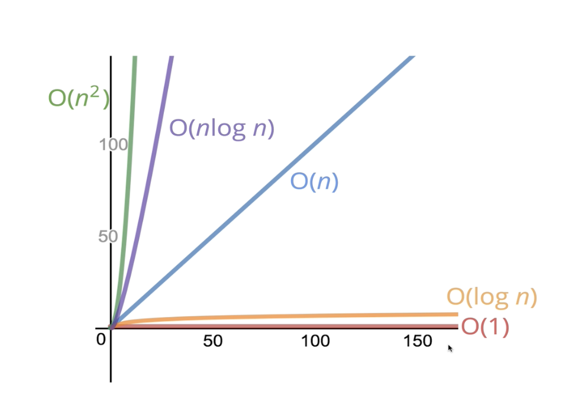

# 2. 빅오 표기법(Big O Notation)

## 2.5 빅오 소개

목표:

- 빅오 표기법의 필요성
- 빅오란?
- 빅오를 간단하게 표현하는 방법
- 시간 복잡성, 공간 복잡성
- 빅오 표기법을 사용해서 여러 알고리즘을 평가
- 알고리즘에 대한 설명

빅오를 알면 비효율적인 코드를 찾는 데 도움이 된다.

## 2.6 코드 시간 재기

JS 내장된 함수를 사용

```js
// slower
function addUpTo(n) {
  let total = 0;
  for (let i = 1; i <= n; i++) {
    total += i;
  }
  return total;
}

var t1 = performance.now();
addUpTo(1000000000);
var t2 = performance.now();
console.log(`Time Elapsed: ${(t2 - t1) / 1000} seconds.`);
```

```js
// faster
function addUpTo(n) {
  return (n * (n + 1)) / 2;
}

var time1 = performance.now();
addUpTo(1000000000);
var time2 = performance.now();
console.log(`Time Elapsed: ${(time2 - time1) / 1000} seconds.`);
```

- 다만, 이러한 방식은 기기마다 실행 속도가 달라질 수 있어서 문제가 있음.
- 심지어 같은 기기에서 실행할 때마다 다른 시간이 측정되기도 함.
- 즉, 시간 측정이 정확하지 않다는 것.
- 따라서 빅오 표기법이 필요함

## 2.7 연산 갯수 세기

- 시간을 비교하지 않는다면, 연산 갯수를 세는 방법도 있음
- 모든 연산을 세는 것은 힘듦
- slower 함수의 경우 N이 커질수록 연산의 갯수도 비례해서 늘어남

## 2.8 시간복잡도 시각화하기

강사가 직접 제작한 툴: https://rithmschool.github.io/function-timer-demo/

## 2.9 <중요!> 빅오에 대한 공식 소개(시간복잡도)

- 함수에 입력한 값의 크기가 늘어날수록 함수의 알고리즘 실행시간이 어떻게 변하는지 설명하는 공식적인 방식
- 입력의 크기 실행시간의 관계
- 실행시간이 가질 수 있는 최대치
- 입력한 n이 커질수록 알고리즘이 얼마나 효율적인지 표현하는 방식
- 전체적인 추세가 중요함(그래프)
- 반복문은 조건에 따른 반복 횟수, 증감 여부가 시간복잡도를 결정한다.
- 반복문이 중첩될 경우 각 반복문 횟수를 곱한다.
- ChatGPT: 빅오 표기법이란, 알고리즘의 시간 복잡도(Time Complexity) 또는 공간 복잡도(Space Complexity)를 나타내는 수학적 표기
- 주어진 입력 크기(n)에 따라 알고리즘의 성능(실행 시간 또는 사용하는 메모리)이 어떻게 변하는지를 표현함

# 2.10 빅오 표현식의 단순화하기

- `O(2n) => O(n)`
- `O(500) => O(1)`
- `O(13N^2) => O(n^2)`
- `O(n + 10) => O(n)`
- `O(1000n + 50) => O(n)`
- `O(n^2 + 5n + 8) => O(n^2)`
- 위와 같이 중요한 것과 중요하지 않은 것을 구분해서 단순화 할 수 있음

- 시간복잡도 그래프
  

## 시간복잡도 퀴즈2

### 2.1

```js
function logAtMost10(n) {
  for (var i = 1; i <= Math.min(n, 10); i++) {
    console.log(i);
  }
}
```

- 정답: O(1)
- 해설: logAtMost10 함수는 n이 얼마든지 크더라도 최대 10번만 루프를 실행하므로

### 2.2

```js
function logAtLeast10(n) {
  for (var i = 1; i <= Math.max(n, 10); i++) {
    console.log(i);
  }
}
```

- 정답: O(n)
- 해설:
  - 만약 n < 10이라면 반복 횟수는 고정적으로 10번이며, n >= 10이라면 반복 횟수는 n번임.
  - O(n + 10)이지만 단순화하여 O(n)

### 2.3

```js
function onlyElementsAtEvenIndex(array) {
  var newArray = Array(Math.ceil(array.length / 2));
  for (var i = 0; i < array.length; i++) {
    if (i % 2 === 0) {
      newArray[i / 2] = array[i];
    }
  }
  return newArray;
}
```

- 정답: O(n)
- 해설: 배열의 크기(array.length = n)에 따라 반복문의 반복 횟수는 n

# 2.11 공간 복잡도

- 공간 = 사용되는 메모리, 알고리즘 자체가 필요로 하는 공간
- boolean, number, undefined, null은 불변 공간
- array, object, string은 O(n)의 공간을 차지함(값의 길이에 따라 무한하게 커질 수 있기 때문)

## ex1

```js
function sum(arr) {
  let total = 0;
  for (let i = 0; i < arr.length; i++) {
    total += arr[i];
  }
  return total;
}
```

- 공간복잡도: O(1)
- 입력의 크기와 상관없이 항상 같은 공간을 가짐. 새로운 변수를 만들지 않기 때문

## ex2

```js
function double(arr) {
  let newArr = [];
  for (let i = 0; i < arr.length; i++) {
    newArr.push(2 * arr[i]);
  }
  return newArr;
}
```

- 공간복잡도: O(n)
- 배열의 길이가 50이면 새로운 배열에 저장되는 아이템이 50개가 되어 리턴됨
- 입력한 크기만큼 비례되어 새 공간을 만듦

## ex3

```js
function logUpTo(n) {
  for (var i = 1; i <= n; i++) {
    console.log(i);
  }
}
```

- 정답: O(1)

## ex4

```js
function logAtMost10(n) {
  for (var i = 1; i <= Math.min(n, 10); i++) {
    console.log(i);
  }
}
```

- 정답: O(1)

## ex5

```js
function onlyElementsAtEvenIndex(array) {
  var newArray = Array(Math.ceil(array.length / 2));
  for (var i = 0; i < array.length; i++) {
    if (i % 2 === 0) {
      newArray[i / 2] = array[i];
    }
  }
  return newArray;
}
```

- 정답: O(n)

## ex6

```js
function subtotals(array) {
  var subtotalArray = Array(array.length);
  for (var i = 0; i < array.length; i++) {
    var subtotal = 0;
    for (var j = 0; j <= i; j++) {
      subtotal += array[j];
    }
    subtotalArray[i] = subtotal;
  }
  return subtotalArray;
}
```

- 정답: O(n)
- subtotalArray는 입력 파라미터 array의 길이와 동일한 크기의 새로운 배열을 가짐.
- 입력 배열의 크기에 따라 O(n)의 공간을 차지함
- 참고로 시간복잡도는 중첩반복문 때문에 O(n^2)이다. i가 증가할수록 내부 반복문이 i+1번 실행되기 때문.

## 2.12 로그와 섹션 요약

- 로그의 시간복잡도는 아주 좋다.
- 이 개념이 사용되는 곳은, 탐색 알고리즘/효율적인 정렬 알고리즘/재귀(공간복잡도)

### 개념 정리

- 빅오 표기법 = 알고리즘의 성능을 분석하기 위함
- 입력의 크기에 따른 정확도가 아닌 전체적인 추세에 주목해야 함
- 입력의 크기에 따른 실행시간 또는 공간 복잡도가 어떻게 변하는지.
- 빅오 표기법으로 측정하는 알고리즘 성능은 하드웨어의 영향을 받지 않는다. 실행될 연산의 갯수를 따지기 때문
- 빅오 표기법은 모든 곳에서 사용됨
